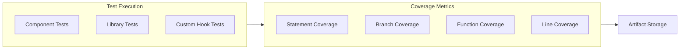
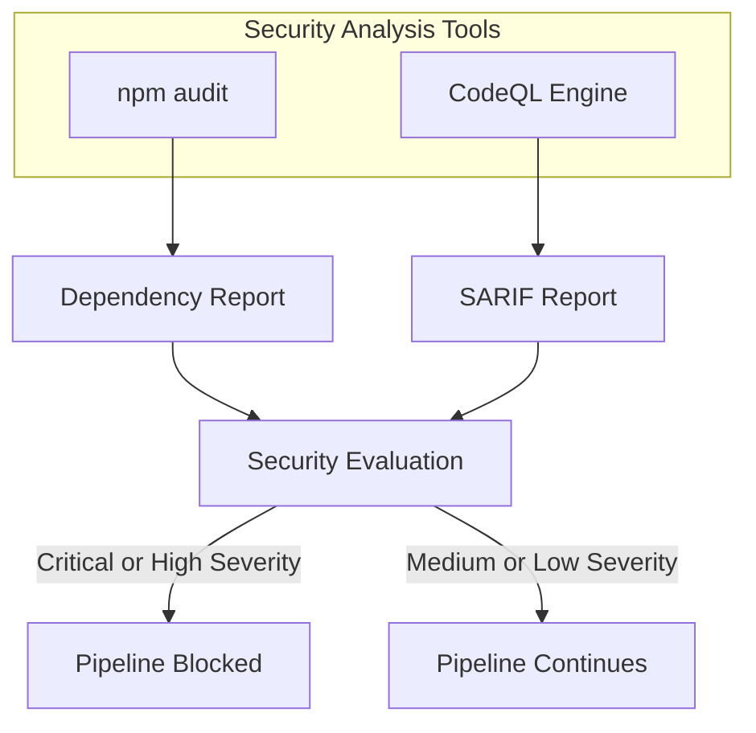
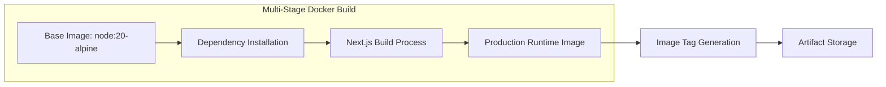
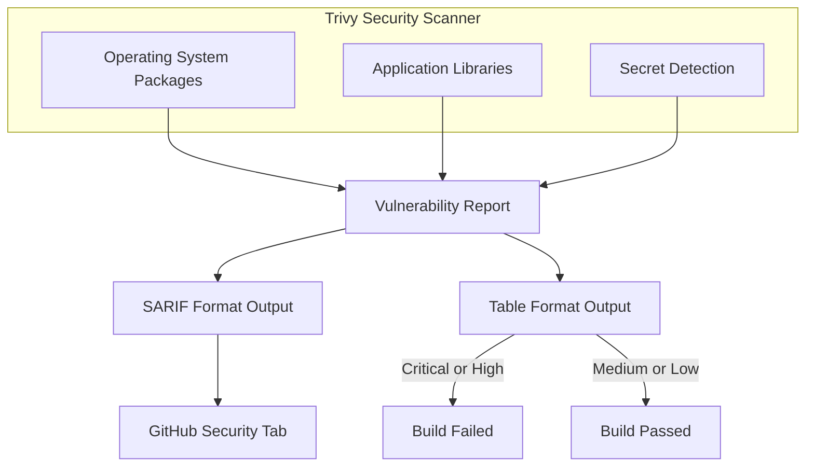
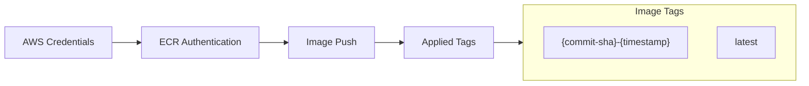
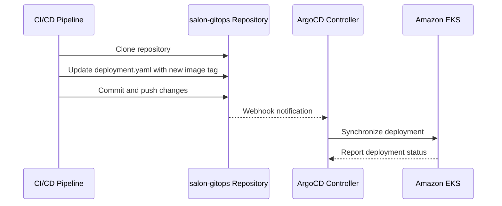
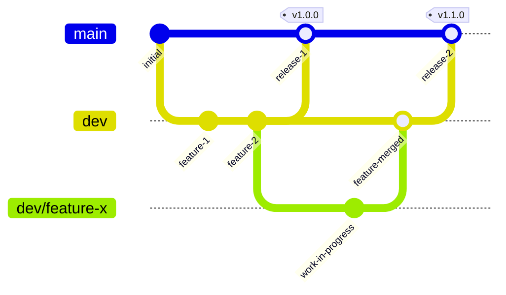

# CI/CD Pipeline Documentation

## Overview

This document describes the Continuous Integration and Continuous Deployment (CI/CD) pipeline for the Salon Booking Frontend application. The pipeline automates code quality verification, security scanning, container image building, and deployment to AWS EKS through GitOps practices.

## Pipeline Architecture

The following diagram illustrates the complete CI/CD pipeline flow:

```mermaid
flowchart TB
    subgraph Triggers["Pipeline Triggers"]
        push["Push Event"]
        pr["Pull Request"]
        manual["Manual Dispatch"]
    end

    subgraph Stage1["Stage 1: Code Quality"]
        checkout1["Checkout Repository"]
        setup_node1["Setup Node.js 20"]
        install1["Install Dependencies"]
        eslint["Execute ESLint"]
        tsc["TypeScript Validation"]
    end

    subgraph Stage2["Stage 2: Unit Testing"]
        checkout2["Checkout Repository"]
        install2["Install Dependencies"]
        jest["Execute Jest Tests"]
        coverage["Generate Coverage Report"]
    end

    subgraph Stage3["Stage 3: Security Analysis"]
        checkout3["Checkout Repository"]
        npm_audit["Dependency Audit"]
        codeql_init["Initialize CodeQL"]
        codeql_analyze["Execute CodeQL Analysis"]
    end

    subgraph Stage4["Stage 4: Container Build"]
        checkout4["Checkout Repository"]
        buildx["Configure Docker Buildx"]
        meta["Generate Image Metadata"]
        docker_build["Build Container Image"]
        save_image["Archive Image Artifact"]
    end

    subgraph Stage5["Stage 5: Container Security"]
        load_image["Load Image Artifact"]
        trivy_sarif["Trivy SARIF Scan"]
        trivy_table["Trivy Table Report"]
        upload_sarif["Upload Security Results"]
    end

    subgraph Stage6["Stage 6: Registry Push"]
        aws_creds["Configure AWS Credentials"]
        ecr_login["Authenticate to ECR"]
        docker_push["Push Container Image"]
    end

    subgraph Stage7["Stage 7: GitOps Deployment"]
        clone_gitops["Clone GitOps Repository"]
        update_manifest["Update Kubernetes Manifest"]
        git_push["Commit and Push Changes"]
    end

    subgraph Outputs["Deployment Targets"]
        ecr["AWS ECR Registry"]
        argocd["ArgoCD Controller"]
        eks["Amazon EKS Cluster"]
    end

    push & pr & manual --> Stage1
    Stage1 --> Stage2
    Stage1 --> Stage3
    Stage2 --> Stage4
    Stage3 --> Stage4
    Stage4 --> Stage5
    Stage5 --> Stage6
    Stage6 --> Stage7
    Stage7 --> ecr
    ecr --> argocd
    argocd --> eks
```



## Pipeline Stages

### Stage 1: Code Quality

This stage validates code quality and TypeScript type correctness.

| Step | Description | Tool |
|------|-------------|------|
| Checkout Repository | Clone source code | actions/checkout@v4 |
| Setup Node.js | Configure Node.js 20 runtime | actions/setup-node@v4 |
| Install Dependencies | Install npm packages | npm ci |
| Execute ESLint | Validate code against linting rules | ESLint |
| TypeScript Validation | Verify type correctness | tsc --noEmit |

### Stage 2: Unit Testing

This stage executes the test suite and generates coverage metrics.



**Coverage Thresholds**

| Metric | Minimum Threshold |
|--------|-------------------|
| Statement Coverage | 50% |
| Branch Coverage | 50% |
| Function Coverage | 50% |
| Line Coverage | 50% |

### Stage 3: Security Analysis (SAST)

This stage performs static application security testing on the codebase.



**Security Tools**

| Tool | Purpose |
|------|---------|
| npm audit | Scans npm dependencies for known vulnerabilities |
| CodeQL | Static analysis engine for JavaScript/TypeScript security patterns |

### Stage 4: Container Build

This stage creates an optimized, production-ready container image.



**Container Image Specifications**

| Attribute | Value |
|-----------|-------|
| Base Image | node:20-alpine |
| Build Type | Multi-stage |
| Output Mode | Standalone |
| Runtime User | Non-root (nextjs) |
| Exposed Port | 3000 |

### Stage 5: Container Security Scan

This stage scans the container image for vulnerabilities prior to deployment.



**Trivy Configuration**

| Setting | Value |
|---------|-------|
| Severity Levels | CRITICAL, HIGH, MEDIUM |
| Unfixed Vulnerabilities | Ignored |
| Output Formats | SARIF, Table |

### Stage 6: Registry Push

This stage publishes the verified container image to AWS ECR.

**Execution Conditions**
- Branch: main or dev only
- Prerequisites: All previous stages must pass



### Stage 7: GitOps Deployment

This stage updates Kubernetes manifests to trigger ArgoCD deployment.



## Environment Configuration

### Required GitHub Secrets

| Secret Name | Description |
|-------------|-------------|
| AWS_ACCESS_KEY_ID | AWS IAM access key for ECR authentication |
| AWS_SECRET_ACCESS_KEY | AWS IAM secret access key for ECR authentication |
| GITOPS_TOKEN | GitHub Personal Access Token for GitOps repository |

### Pipeline Environment Variables

| Variable | Value |
|----------|-------|
| AWS_REGION | eu-north-1 |
| ECR_REGISTRY | 024955634588.dkr.ecr.eu-north-1.amazonaws.com |
| ECR_REPOSITORY | salon-frontend |
| GITOPS_REPO | salon-gitops |

## Branch Strategy

The pipeline behavior varies based on the source branch:



| Branch | Pipeline Behavior |
|--------|-------------------|
| main | Full pipeline execution with production deployment |
| dev | Full pipeline execution with staging deployment |
| dev/* | Build and test stages only (no deployment) |
| Pull Request | Build and test stages only (no deployment) |

## Workflow Files

| File | Purpose |
|------|---------|
| .github/workflows/ci-cd-pipeline.yml | Primary CI/CD workflow |
| .github/workflows/dependency-scan.yml | Scheduled weekly vulnerability scan |

## Troubleshooting

### ESLint Failures

```bash
# Validate linting locally
npm run lint

# Automatically fix issues
npm run lint -- --fix
```

### TypeScript Compilation Errors

```bash
# Validate types locally
npx tsc --noEmit
```

### Test Failures

```bash
# Execute tests locally
npm test

# Execute tests with coverage report
npm run test:coverage
```

### Docker Build Failures

```bash
# Build container locally
docker build -t salon-frontend .

# Build without cache
docker build --no-cache -t salon-frontend .
```

### Trivy Scan Failures

```bash
# Install Trivy (macOS)
brew install trivy

# Scan container image
trivy image salon-frontend:latest
```

## Monitoring and Notifications

### Pipeline Notifications

Configure the following in GitHub repository settings:
- Email notifications on pipeline failure
- Slack integration for team notifications (optional)
- Required status checks for pull requests

### Security Monitoring

Review the following locations for security information:
- GitHub Security tab: Code scanning alerts
- GitHub Security tab: Dependabot alerts
- Pipeline artifacts: Trivy scan reports

## Best Practices

1. Execute tests locally before pushing changes
2. Review security scan results after each pipeline execution
3. Maintain up-to-date dependencies
4. Follow semantic commit message conventions
5. Require pull request reviews for protected branches
