# 🚀 CI/CD Pipeline Documentation

## Overview

The Salon Booking Frontend CI/CD pipeline automates the build, test, security scanning, and deployment process. It ensures code quality, security compliance, and reliable deployments to AWS EKS via GitOps.

## Pipeline Architecture

```mermaid
flowchart TB
    subgraph Triggers["🎯 Pipeline Triggers"]
        push["Push to main/dev"]
        pr["Pull Request"]
        manual["Manual Dispatch"]
    end

    subgraph Stage1["📝 Stage 1: Lint & Type Check"]
        checkout1["Checkout Code"]
        setup_node1["Setup Node.js 20"]
        install1["npm ci"]
        eslint["ESLint"]
        tsc["TypeScript Check"]
    end

    subgraph Stage2["🧪 Stage 2: Unit Tests"]
        checkout2["Checkout Code"]
        install2["npm ci"]
        jest["Jest Tests"]
        coverage["Coverage Report"]
    end

    subgraph Stage3["🔐 Stage 3: Security Scan"]
        checkout3["Checkout Code"]
        npm_audit["npm audit"]
        codeql_init["CodeQL Init"]
        codeql_analyze["CodeQL Analysis"]
    end

    subgraph Stage4["🏗️ Stage 4: Build"]
        checkout4["Checkout Code"]
        buildx["Docker Buildx"]
        meta["Generate Tags"]
        docker_build["Build Image"]
        save_image["Save Artifact"]
    end

    subgraph Stage5["🛡️ Stage 5: Trivy Scan"]
        load_image["Load Image"]
        trivy_sarif["Trivy SARIF"]
        trivy_table["Trivy Table"]
        upload_sarif["Upload Results"]
    end

    subgraph Stage6["📦 Stage 6: Push to ECR"]
        aws_creds["AWS Credentials"]
        ecr_login["ECR Login"]
        docker_push["Push Image"]
    end

    subgraph Stage7["🔄 Stage 7: GitOps Update"]
        clone_gitops["Clone GitOps Repo"]
        update_manifest["Update Manifest"]
        git_push["Commit & Push"]
    end

    subgraph Outputs["✅ Outputs"]
        ecr["AWS ECR"]
        argocd["ArgoCD Sync"]
        eks["EKS Deployment"]
    end

    push & pr & manual --> Stage1
    Stage1 --> Stage2
    Stage1 --> Stage3
    Stage2 --> Stage4
    Stage3 --> Stage4
    Stage4 --> Stage5
    Stage5 --> Stage6
    Stage6 --> Stage7
    Stage7 --> ecr
    ecr --> argocd
    argocd --> eks

    classDef trigger fill:#e1f5fe,stroke:#01579b
    classDef lint fill:#fff3e0,stroke:#e65100
    classDef test fill:#e8f5e9,stroke:#2e7d32
    classDef security fill:#fce4ec,stroke:#c2185b
    classDef build fill:#f3e5f5,stroke:#7b1fa2
    classDef scan fill:#fff8e1,stroke:#f57f17
    classDef push fill:#e0f2f1,stroke:#00695c
    classDef gitops fill:#e8eaf6,stroke:#303f9f
    classDef output fill:#f1f8e9,stroke:#558b2f

    class push,pr,manual trigger
    class checkout1,setup_node1,install1,eslint,tsc lint
    class checkout2,install2,jest,coverage test
    class checkout3,npm_audit,codeql_init,codeql_analyze security
    class checkout4,buildx,meta,docker_build,save_image build
    class load_image,trivy_sarif,trivy_table,upload_sarif scan
    class aws_creds,ecr_login,docker_push push
    class clone_gitops,update_manifest,git_push gitops
    class ecr,argocd,eks output
```



## Pipeline Stages

### Stage 1: Lint & Type Check

**Purpose**: Ensure code quality and TypeScript type safety.

| Step | Description | Tool |
|------|-------------|------|
| Checkout | Clone repository | actions/checkout@v4 |
| Setup Node.js | Install Node.js 20 | actions/setup-node@v4 |
| Install deps | Install npm packages | npm ci |
| ESLint | Run linting rules | eslint |
| Type check | Verify TypeScript types | tsc --noEmit |

### Stage 2: Unit Tests

**Purpose**: Validate application logic and measure code coverage.

```mermaid
flowchart LR
    subgraph Tests["Jest Test Suite"]
        components["Component Tests"]
        lib["Library Tests"]
        hooks["Hook Tests"]
    end
    
    subgraph Coverage["Coverage Report"]
        statements["Statements"]
        branches["Branches"]
        functions["Functions"]
        lines["Lines"]
    end
    
    Tests --> Coverage
    Coverage --> artifact["📦 Artifact Upload"]
```



| Metric | Target |
|--------|--------|
| Statement Coverage | ≥80% |
| Branch Coverage | ≥70% |
| Function Coverage | ≥80% |
| Line Coverage | ≥80% |

### Stage 3: Security Scan (SAST)

**Purpose**: Identify security vulnerabilities in code and dependencies.

```mermaid
flowchart TB
    subgraph SAST["Security Analysis"]
        npm_audit["npm audit\n(Dependency Scan)"]
        codeql["CodeQL\n(Static Analysis)"]
    end
    
    npm_audit --> findings1["Vulnerability Report"]
    codeql --> findings2["SARIF Report"]
    
    findings1 --> review["Security Review"]
    findings2 --> review
    review --> |"Critical/High"| block["❌ Block Pipeline"]
    review --> |"Medium/Low"| continue["✅ Continue"]
```



**Security Tools**:
- **npm audit**: Scans dependencies for known vulnerabilities
- **CodeQL**: Static analysis for JavaScript/TypeScript security patterns

### Stage 4: Build Docker Image

**Purpose**: Create optimized, production-ready container image.


**Dockerfile Features**:
- Multi-stage build for smaller image size
- Standalone output mode for optimal production deployment
- Non-root user for security
- Alpine base image for minimal attack surface

### Stage 5: Trivy Security Scan

**Purpose**: Scan container image for vulnerabilities before deployment.

```mermaid
flowchart TB
    subgraph Trivy["Trivy Scanner"]
        os_scan["OS Package Scan"]
        lib_scan["Library Scan"]
        secret_scan["Secret Detection"]
    end
    
    os_scan & lib_scan & secret_scan --> report["Vulnerability Report"]
    
    report --> sarif["SARIF Format"]
    report --> table["Table Format"]
    
    sarif --> github["GitHub Security Tab"]
    table --> |"CRITICAL/HIGH"| fail["❌ Fail Pipeline"]
    table --> |"MEDIUM/LOW"| pass["✅ Pass"]
```



**Scan Configuration**:
- Severity: CRITICAL, HIGH, MEDIUM
- Ignore unfixed vulnerabilities
- Skip cache directories

### Stage 6: Push to ECR

**Purpose**: Store verified container image in AWS ECR.

**Conditions**:
- Only runs on `main` or `dev` branches
- Requires all previous stages to pass


### Stage 7: GitOps Update

**Purpose**: Update Kubernetes manifests for ArgoCD deployment.


## Environment Configuration

### Required Secrets

| Secret | Description |
|--------|-------------|
| `AWS_ACCESS_KEY_ID` | AWS IAM access key for ECR |
| `AWS_SECRET_ACCESS_KEY` | AWS IAM secret key for ECR |
| `GITOPS_TOKEN` | GitHub PAT for GitOps repository |

### Environment Variables

| Variable | Value |
|----------|-------|
| `AWS_REGION` | eu-north-1 |
| `ECR_REGISTRY` | 024955634588.dkr.ecr.eu-north-1.amazonaws.com |
| `ECR_REPOSITORY` | salon-frontend |
| `GITOPS_REPO` | salon-gitops |

## Branch Strategy


| Branch | Pipeline Behavior |
|--------|-------------------|
| `main` | Full pipeline + Production deploy |
| `dev` | Full pipeline + Staging deploy |
| `dev/*` | Build & Test only (no deploy) |
| PR → main/dev | Build & Test only |

## Workflow Files

### Main Pipeline

**File**: `.github/workflows/ci-cd-pipeline.yml`

```
📁 .github/workflows/
├── ci-cd-pipeline.yml     # Main CI/CD workflow
└── dependency-scan.yml    # Weekly vulnerability scan
```

### Dependency Scan

**File**: `.github/workflows/dependency-scan.yml`

- **Schedule**: Weekly (Monday 9:00 AM UTC)
- **Output**: npm audit report artifact

## Troubleshooting

### Common Issues

#### 1. ESLint Failures

```bash
# Check lint errors locally
npm run lint

# Auto-fix issues
npm run lint -- --fix
```

#### 2. TypeScript Errors

```bash
# Check type errors locally
npx tsc --noEmit
```

#### 3. Test Failures

```bash
# Run tests locally
npm test

# Run with coverage
npm run test:coverage
```

#### 4. Docker Build Failures

```bash
# Build locally
docker build -t salon-frontend .

# Check for issues
docker build --no-cache -t salon-frontend .
```

#### 5. Trivy Scan Failures

```bash
# Install Trivy locally
brew install trivy

# Scan image
trivy image salon-frontend:latest
```

## Monitoring & Alerts

### Pipeline Notifications

Configure GitHub repository settings for:
- Email notifications on failure
- Slack integration (optional)
- Status checks for PRs

### Security Alerts

Monitor these locations:
- GitHub Security tab → Code scanning alerts
- GitHub Security tab → Dependabot alerts
- Pipeline artifacts → Trivy reports

## Best Practices

1. **Always run tests locally before pushing**
2. **Review security scan results regularly**
3. **Keep dependencies updated**
4. **Use semantic commit messages**
5. **Require PR reviews for main branch**
