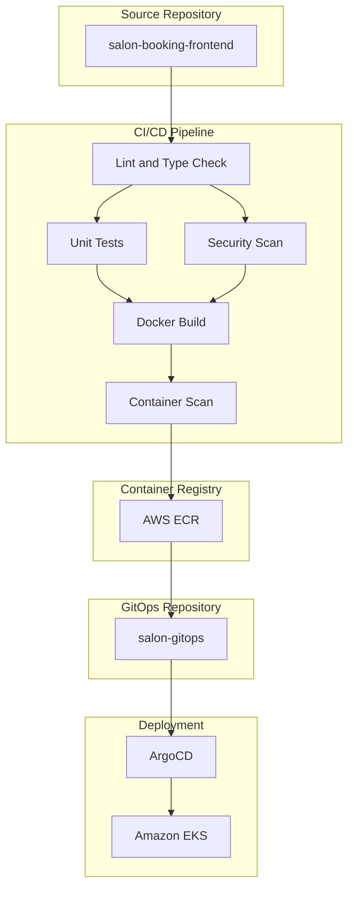

# Salon Booking Frontend Documentation

This directory contains technical documentation for the CI/CD pipeline, security policies, and development practices for the Salon Booking Frontend application.

## Table of Contents

| Document | Description |
|----------|-------------|
| [CI_CD_PIPELINE.md](./CI_CD_PIPELINE.md) | Comprehensive CI/CD pipeline documentation with architecture diagrams |
| [SECURITY.md](./SECURITY.md) | Security policies and vulnerability management guidelines |

## Quick Reference

- **Pipeline Status**: Available in the GitHub Actions tab
- **Security Alerts**: Available in the GitHub Security tab
- **Coverage Reports**: Generated as artifacts in each pipeline execution

## System Architecture Overview

## Technology Stack

| Component | Technology |
|-----------|------------|
| Framework | Next.js 15.x |
| Language | TypeScript 5.x |
| Runtime | Node.js 20.x |
| Testing | Jest, React Testing Library |
| Container | Docker (Alpine-based) |
| Registry | AWS ECR |
| Orchestration | Kubernetes (EKS) |
| GitOps | ArgoCD |

## Related Repositories

| Repository | Purpose |
|------------|---------|
| salon-booking-frontend-dev | Frontend application source code |
| salon-booking-backend-dev | Backend microservices |
| salon-gitops | Kubernetes manifests and ArgoCD configurations |
| salon-k8s-infra | Infrastructure as Code (Terraform) |
