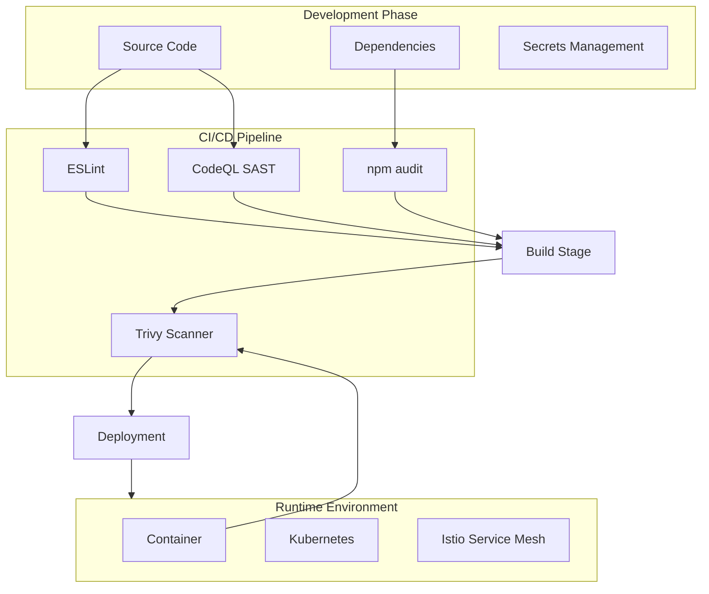
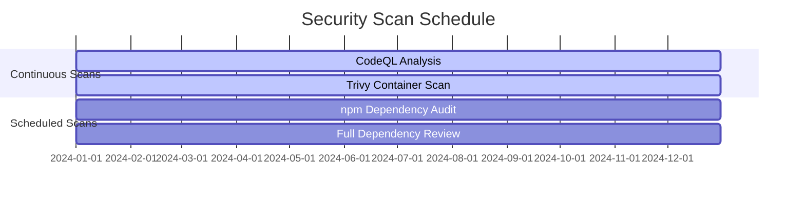
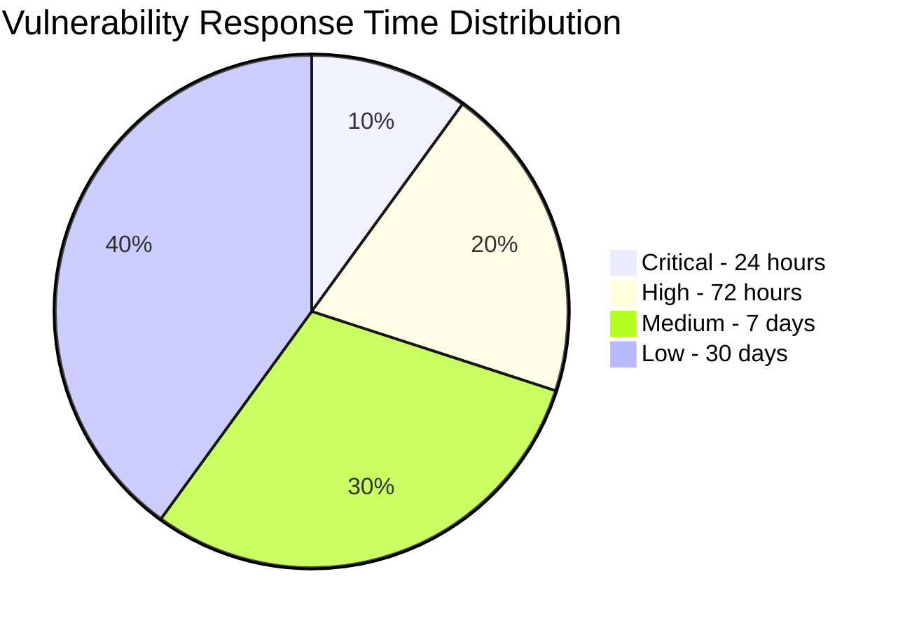
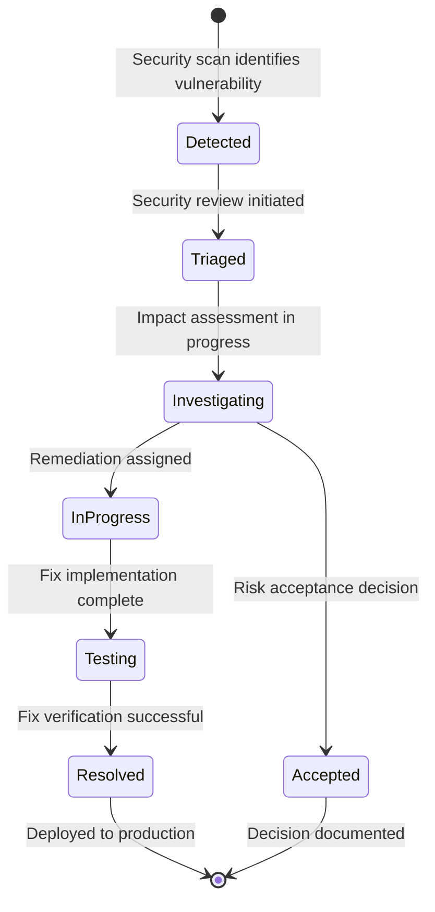
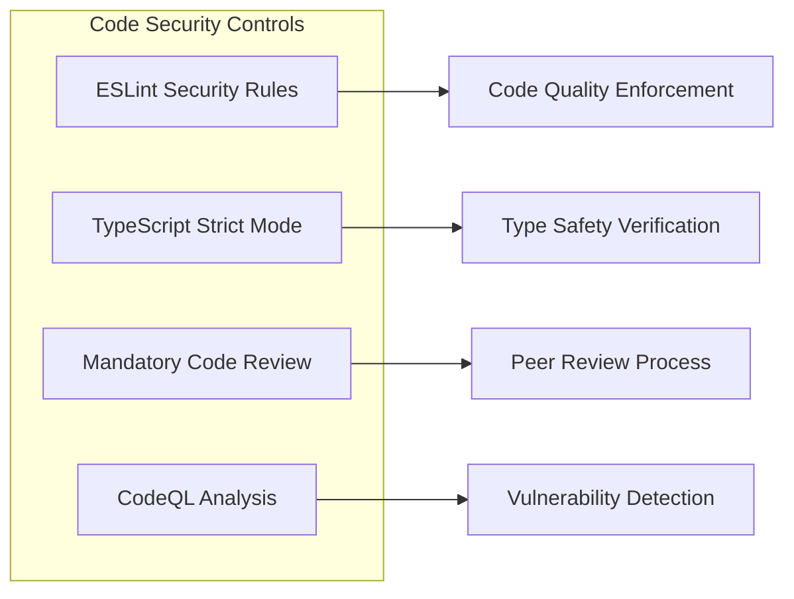
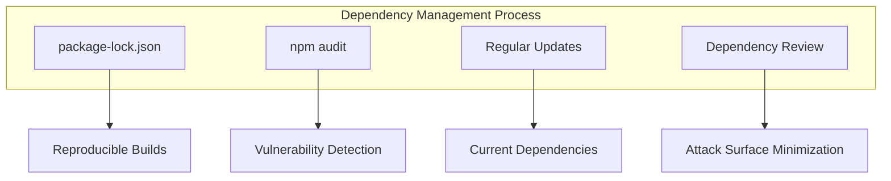
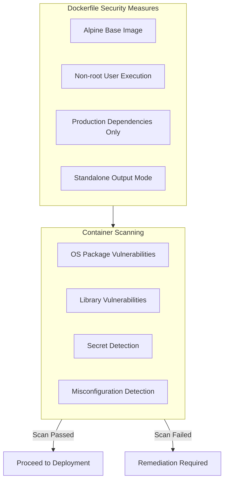
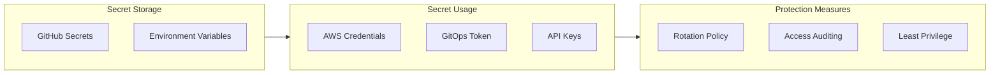
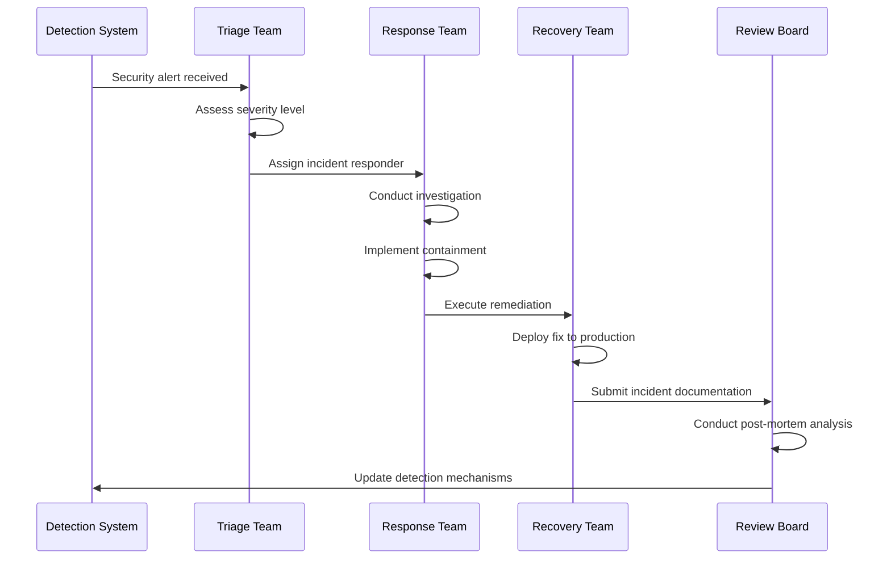

# Security Policy

## Overview

This document defines the security practices, vulnerability management procedures, and incident response protocols for the Salon Booking Frontend application.

## Security Architecture

The following diagram illustrates the security controls implemented across the development lifecycle:



## Vulnerability Management

### Security Scanning Schedule



| Scan Type | Frequency | Tool | Trigger |
|-----------|-----------|------|---------|
| Static Application Security Testing | Every push | CodeQL | CI/CD Pipeline |
| Dependency Vulnerability Scan | Every push | npm audit | CI/CD Pipeline |
| Container Image Scan | Every build | Trivy | CI/CD Pipeline |
| Scheduled Dependency Audit | Weekly | npm audit | Scheduled workflow |

### Severity Classification and Response



| Severity | Response Time | Required Action |
|----------|---------------|-----------------|
| Critical | 24 hours | Immediate patch and production deployment |
| High | 72 hours | Priority patch in next release |
| Medium | 7 days | Scheduled patch in regular release cycle |
| Low | 30 days | Evaluation and resolution during maintenance |

### Vulnerability Remediation Workflow



## Security Controls

### Code Security



**ESLint Security Rules**
- Prohibition of eval() and Function() constructors
- Review requirement for dangerouslySetInnerHTML usage
- HTTPS enforcement for external resource URLs
- Regular expression denial-of-service pattern prevention

**TypeScript Configuration**
```typescript
{
  "compilerOptions": {
    "strict": true,
    "noImplicitAny": true,
    "strictNullChecks": true
  }
}
```

### Dependency Security



**Best Practices**
- Use npm ci for deterministic CI/CD builds
- Commit lock files to version control
- Maintain regular dependency update schedule
- Review all new dependencies prior to addition

### Container Security



**Dockerfile Security Practices**
```dockerfile
# Specify exact version tags
FROM node:20-alpine

# Execute as non-root user
USER nextjs

# Use standalone output mode
# Include production dependencies only
```

### Secrets Management



**Secret Rotation Schedule**

| Secret | Purpose | Rotation Interval |
|--------|---------|-------------------|
| AWS_ACCESS_KEY_ID | ECR Authentication | 90 days |
| AWS_SECRET_ACCESS_KEY | ECR Authentication | 90 days |
| GITOPS_TOKEN | Repository Access | 90 days |

## Security Headers Configuration

The Next.js application should implement the following security headers:

```typescript
// next.config.ts
const securityHeaders = [
  {
    key: 'X-DNS-Prefetch-Control',
    value: 'on'
  },
  {
    key: 'Strict-Transport-Security',
    value: 'max-age=63072000; includeSubDomains; preload'
  },
  {
    key: 'X-Frame-Options',
    value: 'SAMEORIGIN'
  },
  {
    key: 'X-Content-Type-Options',
    value: 'nosniff'
  },
  {
    key: 'Referrer-Policy',
    value: 'origin-when-cross-origin'
  },
  {
    key: 'Content-Security-Policy',
    value: "default-src 'self'; script-src 'self' 'unsafe-eval' 'unsafe-inline';"
  }
];
```

## Incident Response

### Response Process



### Incident Priority Levels

| Priority | Description | Response Requirement |
|----------|-------------|----------------------|
| P1 | Data breach or service compromise | Immediate escalation to leadership |
| P2 | Active exploitation attempt detected | Same-day response required |
| P3 | Vulnerability identified | Response within next business day |
| P4 | Security improvement opportunity | Scheduled maintenance window |

## Compliance Checklist

| Requirement | Status |
|-------------|--------|
| CodeQL analysis enabled | Required |
| npm audit integrated in CI/CD pipeline | Required |
| Trivy container scanning enabled | Required |
| Secrets stored in GitHub Secrets | Required |
| Branch protection rules configured | Required |
| Mandatory code review enabled | Required |
| Security headers configured | Required |
| HTTPS enforcement | Required |
| Regular dependency updates scheduled | Required |

## Vulnerability Reporting

### Responsible Disclosure Process

Security vulnerabilities should be reported through the following process:

1. Do not create public GitHub issues for security vulnerabilities
2. Contact repository maintainers directly via email
3. Provide detailed reproduction steps and impact assessment
4. Allow reasonable time for investigation and response

### Response Timeline

| Action | Expected Timeline |
|--------|-------------------|
| Initial acknowledgment | 24 hours |
| Severity assessment | 48 hours |
| Remediation timeline | Based on severity assessment |
| Public disclosure | Following successful deployment of fix |

## References

- [OWASP Top 10 Web Application Security Risks](https://owasp.org/www-project-top-ten/)
- [Next.js Security Headers Documentation](https://nextjs.org/docs/advanced-features/security-headers)
- [npm Security Best Practices](https://docs.npmjs.com/security)
- [Trivy Documentation](https://aquasecurity.github.io/trivy/)
- [CodeQL Documentation](https://codeql.github.com/docs/)
