# 🔐 Security Policy

## Overview

This document outlines the security practices, vulnerability management, and incident response procedures for the Salon Booking Frontend application.

## Security Architecture


## Vulnerability Management

### Scanning Schedule


| Scan Type | Frequency | Tool | Trigger |
|-----------|-----------|------|---------|
| Static Analysis (SAST) | Every push | CodeQL | CI/CD Pipeline |
| Dependency Scan | Every push | npm audit | CI/CD Pipeline |
| Container Scan | Every build | Trivy | CI/CD Pipeline |
| Weekly Audit | Weekly | npm audit | Scheduled workflow |

### Severity Levels


| Severity | Response Time | Action Required |
|----------|---------------|-----------------|
| **Critical** | 24 hours | Immediate patch, production deployment |
| **High** | 72 hours | Priority patch, next release |
| **Medium** | 1 week | Scheduled patch, regular release |
| **Low** | 1 month | Evaluate and address in maintenance |

### Vulnerability Workflow


## Security Controls

### 1. Code Security


**ESLint Security Rules**:
- No `eval()` or `Function()` constructors
- No `dangerouslySetInnerHTML` without review
- Enforce HTTPS for external URLs
- Prevent regex DoS patterns

**TypeScript Configuration**:
```typescript
{
  "compilerOptions": {
    "strict": true,
    "noImplicitAny": true,
    "strictNullChecks": true
  }
}
```

### 2. Dependency Security


**Best Practices**:
- Use `npm ci` for CI/CD builds
- Lock file committed to repository
- Regular dependency updates
- Review new dependencies before adding

### 3. Container Security

```mermaid
flowchart TB
    subgraph Dockerfile["Dockerfile Security"]
        base["Alpine Base\n(Minimal OS)"]
        nonroot["Non-root User"]
        minimal["No dev dependencies"]
        standalone["Standalone output"]
    end
    
    subgraph Scan["Container Scanning"]
        os["OS vulnerabilities"]
        libs["Library vulnerabilities"]
        secrets["Secret detection"]
        misconfig["Misconfigurations"]
    end
    
    Dockerfile --> Scan
    Scan --> |Pass| deploy["✅ Deploy"]
    Scan --> |Fail| fix["🔧 Fix Required"]
```



**Dockerfile Best Practices**:
```dockerfile
# Use specific version tags
FROM node:20-alpine

# Run as non-root user
USER nextjs

# Use standalone output
# Minimize installed packages
```

### 4. Secrets Management


**Required Secrets**:
| Secret | Purpose | Rotation |
|--------|---------|----------|
| AWS_ACCESS_KEY_ID | ECR access | 90 days |
| AWS_SECRET_ACCESS_KEY | ECR access | 90 days |
| GITOPS_TOKEN | Repository access | 90 days |

## Security Headers

The Next.js application should configure security headers:

```typescript
// next.config.ts
const securityHeaders = [
  {
    key: 'X-DNS-Prefetch-Control',
    value: 'on'
  },
  {
    key: 'Strict-Transport-Security',
    value: 'max-age=63072000; includeSubDomains; preload'
  },
  {
    key: 'X-Frame-Options',
    value: 'SAMEORIGIN'
  },
  {
    key: 'X-Content-Type-Options',
    value: 'nosniff'
  },
  {
    key: 'Referrer-Policy',
    value: 'origin-when-cross-origin'
  },
  {
    key: 'Content-Security-Policy',
    value: "default-src 'self'; script-src 'self' 'unsafe-eval' 'unsafe-inline';"
  }
];
```

## Incident Response

### Response Process


### Incident Severity

| Level | Description | Response |
|-------|-------------|----------|
| P1 | Data breach, service compromise | Immediate escalation |
| P2 | Active exploitation attempt | Same-day response |
| P3 | Vulnerability discovered | Next business day |
| P4 | Security improvement | Scheduled work |

## Compliance

### Security Checklist

- [ ] CodeQL analysis enabled
- [ ] npm audit in CI/CD pipeline
- [ ] Trivy container scanning
- [ ] Secrets stored in GitHub Secrets
- [ ] Branch protection enabled
- [ ] Code review required
- [ ] Security headers configured
- [ ] HTTPS enforced
- [ ] Regular dependency updates

## Reporting Vulnerabilities

### Responsible Disclosure

If you discover a security vulnerability:

1. **Do NOT** create a public GitHub issue
2. Email security concerns to the repository maintainers
3. Include detailed reproduction steps
4. Allow reasonable time for response

### Response Timeline

| Action | Timeline |
|--------|----------|
| Initial response | 24 hours |
| Severity assessment | 48 hours |
| Fix timeline | Based on severity |
| Public disclosure | After fix deployed |

## References

- [OWASP Top 10](https://owasp.org/www-project-top-ten/)
- [Next.js Security](https://nextjs.org/docs/advanced-features/security-headers)
- [npm Security Best Practices](https://docs.npmjs.com/security)
- [Trivy Documentation](https://aquasecurity.github.io/trivy/)
- [CodeQL Documentation](https://codeql.github.com/docs/)
